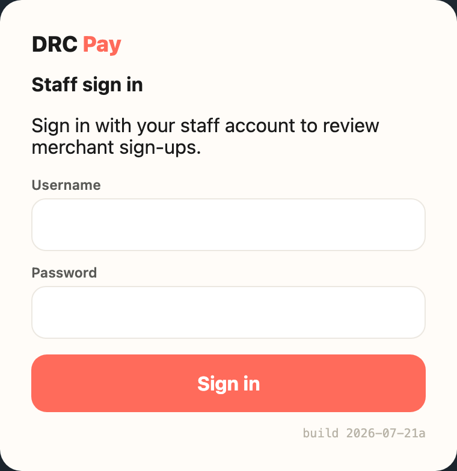
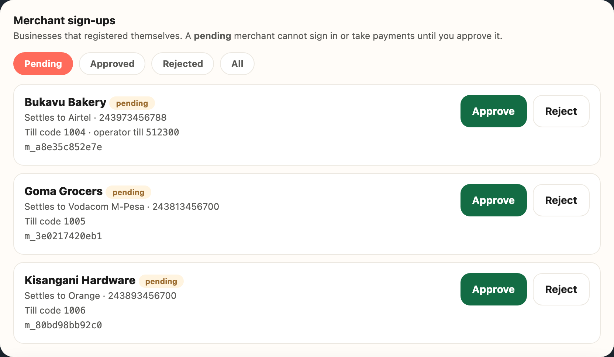
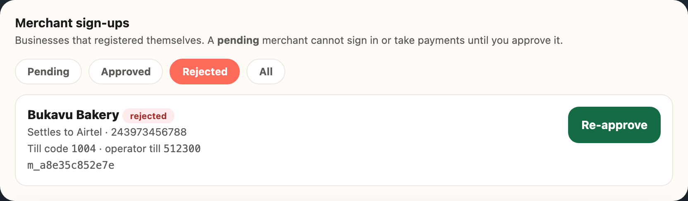
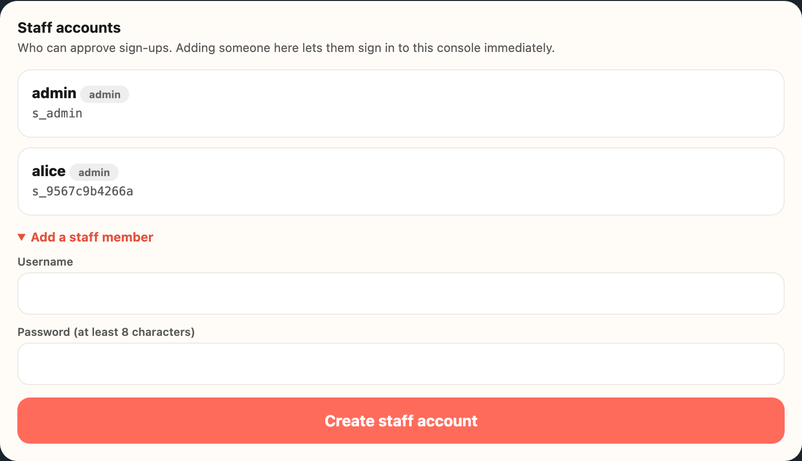

This guide is for the person who approves businesses and manages who else can do that.
You do not need to understand how the app is built to use it.

Almost everything happens on one page: the **Staff page**.

---

## 1. The three pages, and which one is yours

The app has three separate pages. They look similar, so it is worth knowing them apart.

| Page | Who it is for | Address ends in |
|---|---|---|
| **Staff page** | **You.** Approve businesses, manage staff. | `/staff/` |
| Merchant page | Business owners taking payments. | `/console/` |
| Customer page | Shoppers paying a business. No sign-in. | `/customer/` |

**Your sign-in only works on the Staff page.** If you try it on the Merchant page it will say the
username or password is wrong. That is deliberate, not a fault: staff accounts and business accounts
are kept completely separate, so neither can see the other's information.

This catches people out because the plain web address sends you to the Merchant page. Add `/staff/`
to the end, and bookmark it.

---

## 2. Signing in

Open the Staff page address and sign in with **your own** staff username and password.

{width=3.2in}

That is the only password you need. If you reach a page that asks for a business name and payout
number instead, you are on the Merchant page - add `/staff/` to the address.

---

## 3. Approving a business

When a business signs up it lands in a waiting state. Until you approve it, that business
**cannot sign in and cannot take any money.** Nothing happens automatically. It waits for you.

{width=6.3in}

1. Sign in to the Staff page.
2. Look at **Merchant sign-ups**. The **Pending** tab is already selected and lists everyone waiting.
3. Read the details (see the table below).
4. Click **Approve** or **Reject**.

The list updates by itself every few seconds, so a new sign-up appears without reloading.

### What each detail means

| On screen | What it means |
|---|---|
| **Business name** | What the owner typed when signing up. Nothing verifies it, so read it critically. |
| **Settles to** | The mobile money network and phone number where this business receives its money. The important one. |
| **Till code** | A short number the app assigns automatically. Customers can use it to pay from a basic phone. You do not choose it. |
| The long code starting `m_` | The app's internal reference. Ignore it unless someone technical asks. |

### Before you approve, check

- Does the business name look like a real business, not a test or a joke?
- Does the phone number look right for the network shown beside it?
- Do you recognise this business, or were you told to expect it?

Approving is what allows money to start flowing to that phone number. If anything looks wrong, do
not approve it. Ask first. Approving the wrong account costs far more than making someone wait.

### The four tabs

| Tab | Shows |
|---|---|
| **Pending** | Waiting on your decision. Your daily work. |
| **Approved** | Already approved and able to trade. |
| **Rejected** | Turned down. Can be re-approved (see below). |
| **All** | Everything, whatever its state. |

---

## 4. Changing your mind about a rejection

Rejecting is **not** permanent. Open the **Rejected** tab and the business shows a **Re-approve**
button. Clicking it restores full access immediately, exactly as if you had approved it first time.

{width=6.3in}

---

## 5. Adding another staff member

Anyone you add here can approve businesses, exactly like you. Only add people who should have that
power.

{width=6.3in}

1. On the Staff page, find **Staff accounts**. It lists everyone who currently has access.
2. Click **Add a staff member**.
3. Enter a username and a password of at least 8 characters.
4. Click **Create staff account**.

They can sign in straight away on the Staff page.

**Give them the password in person or by private message. Never by shared email or group chat.**

If the username is taken you will see "That username is already taken." Nothing changes when that
happens, and in particular the existing person's password is left alone. Choose another username.

---

## 6. What this page cannot do yet

Ask someone technical for these. The commands are in the appendix.

| Task | Why it is not here |
|---|---|
| Reset a forgotten staff password | Needs a command run against the system |
| Remove a staff member who has left | Same. The app refuses to remove the last remaining account, so someone can always sign in |
| Suspend a business already approved | Not built yet |

---

## 7. When something looks wrong

| What you see | What it usually means |
|---|---|
| A business says it cannot sign in | Check the **Approved** tab. If they are not there, they are still in **Pending** (waiting on you) or **Rejected**. Approving or re-approving fixes it. |
| You cannot sign in yourself | Usually the Merchant page instead of the Staff page, or the wrong capital letters in the username. Otherwise ask for a password reset. |
| A payment looks stuck | Payments confirm on their own, usually within seconds, and anything still waiting is re-checked automatically. Not something you fix from this page. |
| Someone you do not recognise in **Staff accounts** | Treat it seriously and raise it at once. Anyone listed there can approve businesses, and so can direct money to a phone number. |

---

## 8. Words you will see

| Word | Meaning |
|---|---|
| **Pending** | Signed up, waiting on your decision, can do nothing yet |
| **Approved** (shown as *active*) | Can sign in and take payments |
| **Rejected** | Turned down and locked out, but can be re-approved |
| **Settles to** | The network and phone number where a business receives its money |
| **Till code** | The short number a customer dials to pay a business from a basic phone |
| **Same-network payment** | When a customer pays a business on the same mobile money network, the money goes straight to the business and the *owner* confirms they received it. It never reaches your page. |

---

## Appendix: for whoever helps you technically

These run against the deployed database and are not available in the browser.

Reset a password, or create an account outside the page:

    python -m drc_pay_api.create_staff --username NAME

Remove a staff member. This signs them out everywhere, and refuses to remove the last remaining
account:

    python -m drc_pay_api.create_staff --username NAME --remove

The first staff account on a brand-new deployment comes from the `DRCPAY_ADMIN_USERNAME` and
`DRCPAY_ADMIN_PASSWORD` settings. Changing the password setting and redeploying updates that same
account rather than creating a second one.
